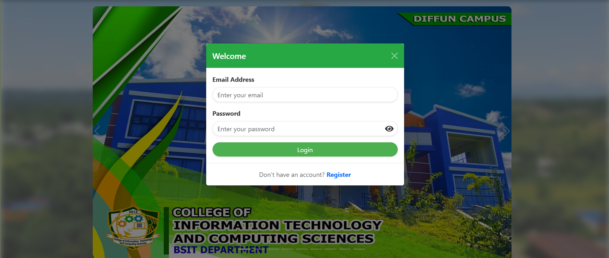
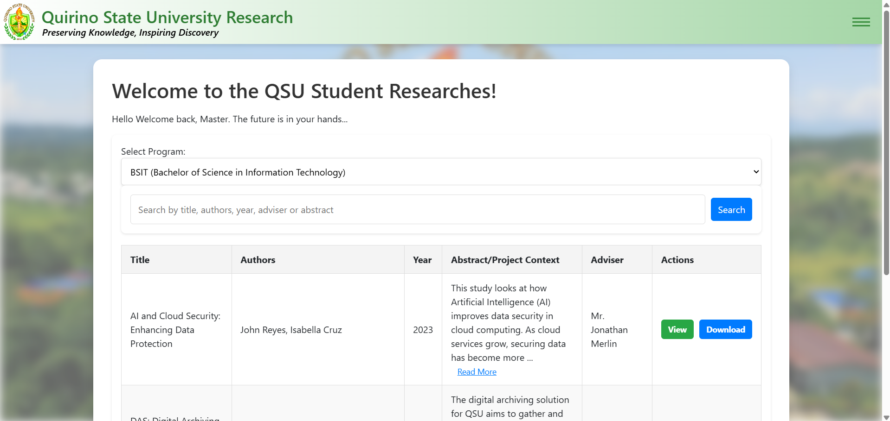

# 📁 Digital Archiving Solution

A web-based document management system developed using PHP and MySQL.

This project allows administrators and users to securely upload, organize, search, and manage research documents.

## 📷 Screenshots

### Login Page

### Dashboard

### Folder Management

### Upload Document

## ✨ Features

- User Authentication
- Upload Documents
- Download Files
- Folder Management
- Search Documents
- Archive Research
- Admin Dashboard
- User Management

## 🛠 Tech Stack

- PHP
- MySQL
- HTML5
- CSS3
- JavaScript
- Bootstrap

## 🚀 Installation

1. Clone this repository

git clone https://github.com/guillerdiola/digital-archiving-solution.git

2. Import the database

3. Move the project into XAMPP/htdocs

4. Start Apache and MySQL

5. Open

http://localhost/DAS

## 👨‍💻 Developer

Guiller Diola

BSIT Graduate

## 📚 Currently Learning

- 🌐 Web Development (PHP, HTML, CSS, JavaScript)
- 🗄️ Database Management (MySQL)
- 📊 Data Analytics
- 📈 Business Intelligence
- 📉 Power BI Dashboard Development
- 📑 Microsoft Excel (Advanced Formulas & Dashboards)
- 📝 SQL Query Optimization
- 🔍 Data Visualization
- 🌱 Git & GitHub
- ☁️ Cloud Fundamentals
